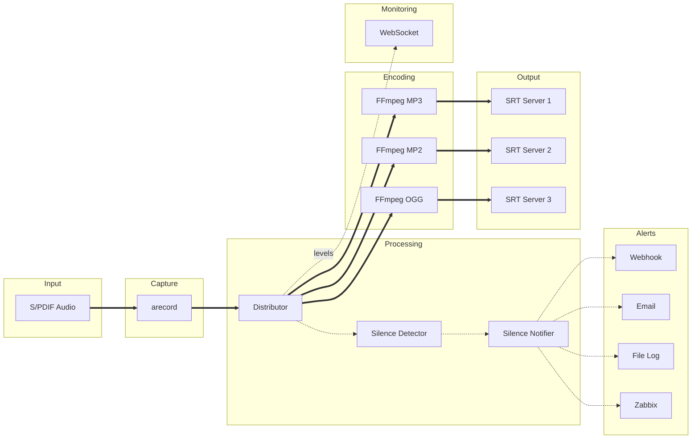
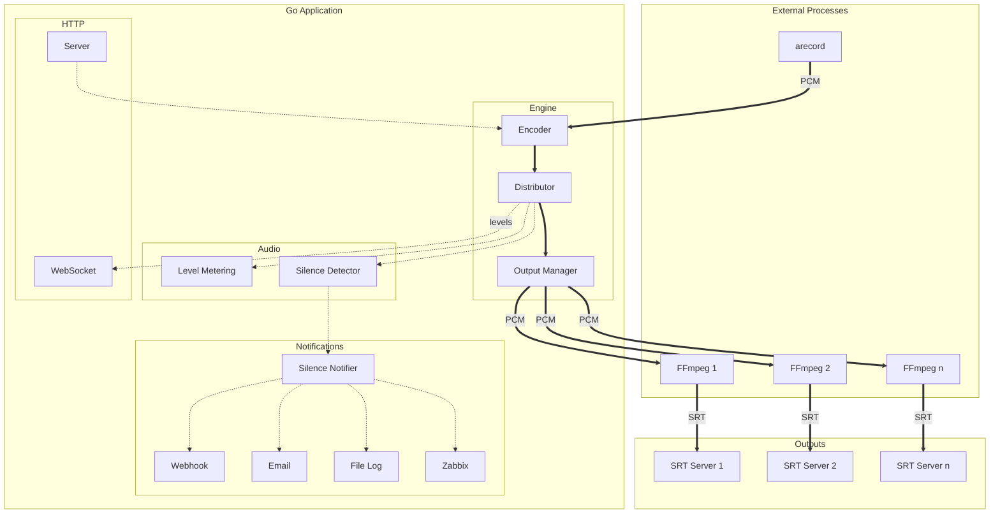

# ZuidWest FM Encoder

Audio streaming software for [ZuidWest FM](https://www.zuidwestfm.nl/) and [Radio Rucphen](https://www.rucphenrtv.nl/). Stream audio from a Raspberry Pi to multiple SRT destinations simultaneously. Built for broadcast environments with real-time monitoring and web-based configuration.


## Features

- **Multi-output streaming** - Send to multiple SRT servers with different codecs simultaneously
- **Real-time VU meters** - Peak hold (1.5 s) with peak/RMS toggle, clip detection, updated via WebSocket
- **Silence detection** - Alerts via webhook, email, file log, or Zabbix when audio drops below threshold
- **Web interface** - Configure outputs, select audio input, monitor levels
- **Auto-recovery** - Automatic reconnection with configurable retry limits per output
- **Multiple codecs** - MP3, MP2, Ogg Vorbis, or uncompressed WAV per output
- **Update notifications** - Alerts when new versions are available
- **Single binary** - Web interface embedded, minimal runtime dependencies

## Platform Support

| Platform | Status | Audio Capture |
|----------|--------|---------------|
| Linux (Raspberry Pi) | **Primary** | arecord (ALSA) |
| macOS | Development only | FFmpeg (AVFoundation) |
| Windows | Experimental | FFmpeg (DirectShow) |

Linux on Raspberry Pi is the primary supported platform. macOS support exists for local development. Windows support is experimental and not recommended for production use.

## Requirements

- Raspberry Pi 4 or 5
- [HiFiBerry Digi+ I/O](https://www.hifiberry.com/shop/boards/hifiberry-digi-io/) or [HiFiBerry DAC+ ADC](https://www.hifiberry.com/shop/boards/dacplus-adc/)
- Raspberry Pi OS Trixie Lite (64-bit)
- `ffmpeg` (for encoding)
- `alsa-utils` (for audio capture via `arecord`)

## Installation

1. Install Raspberry Pi OS Trixie Lite (64-bit)
2. Configure HiFiBerry following the [official guide](https://www.hifiberry.com/docs/software/configuring-linux-3-18-x/)
3. Run the installer as root:

```bash
sudo su
/bin/bash -c "$(curl -fsSL https://raw.githubusercontent.com/oszuidwest/zwfm-encoder/main/deploy/install.sh)"
```

The web interface will be available at `http://<raspberry-pi-ip>:8080`

**Default credentials:** `admin` / `encoder`

## Audio Input

Connect the digital output of your audio processor to the HiFiBerry input.

**Requirements:**
- 48 kHz sample rate
- 16-bit depth
- Stereo (2 channels)
- S/PDIF format preferred (AES/EBU compatibility not guaranteed)

## Codecs

| Codec | Encoder | Bitrate | Notes |
|-------|---------|---------|-------|
| MP3 | libmp3lame | 320 kbit/s | — |
| MP2 | libtwolame | 384 kbit/s | Uses psymodel 4 |
| Ogg | libvorbis | ~500 kbit/s (Q10) | — |
| WAV | pcm_s16le | Uncompressed | — |

## Silence Detection

Monitors audio levels and sends alerts when silence is detected or recovered. Uses hysteresis to prevent alert flapping:

| Setting | Default | Range | Description |
|---------|---------|-------|-------------|
| Threshold | -40 dB | -60 to 0 | Audio level below which silence is detected |
| Duration | 15 s | 1 to 300 | Seconds of silence before alerting |
| Recovery | 5 s | 1 to 60 | Seconds of audio before recovery |

**Alerting options** (can use multiple simultaneously):
- **Webhook** - POST request to a URL on silence start and recovery
- **Email** - Microsoft Graph API notification to configured recipients on silence start and recovery
- **File Log** - Append JSON Lines to a local file for each silence event
- **Zabbix** - Send trapper items to a Zabbix server on silence start and recovery

Configure via the web interface under Settings → Alerts.

### Microsoft 365 Email Setup

Email notifications are sent via Microsoft Graph API using Client Credentials flow (app-only authentication).

**Step 1: Create an App Registration**

1. Go to [Azure Portal - App registrations](https://portal.azure.com/#view/Microsoft_AAD_RegisteredApps/ApplicationsListBlade)
2. Click **New registration**
3. Enter a name (e.g., "Audio Encoder Alerts")
4. Select **Accounts in this organizational directory only**
5. Leave Redirect URI empty and click **Register**
6. Copy the **Application (client) ID** and **Directory (tenant) ID** from the Overview page

**Step 2: Add API Permissions**

1. In your app registration, go to **API permissions**
2. Click **Add a permission** → **Microsoft Graph** → **Application permissions**
3. Add these permissions:
   - `Mail.Send` - Required for sending emails
   - `Application.Read.All` - Optional, enables secret expiry warnings in the UI
4. Click **Grant admin consent for [your organization]** (requires admin rights)

> **Tip:** If you don't have admin rights, ask your IT administrator to grant consent via [Enterprise applications](https://portal.azure.com/#view/Microsoft_AAD_IAM/StartboardApplicationsMenuBlade/~/AppAppsPreview).

**Step 3: Create a Client Secret**

1. Go to **Certificates & secrets** → **Client secrets**
2. Click **New client secret**
3. Add a description and select an expiry period (max 24 months)
4. Click **Add** and **immediately copy the secret value** (it won't be shown again)

> **Note:** Set a calendar reminder to rotate the secret before it expires. The encoder shows a warning banner when the secret expires within 30 days.

**Step 4: Create or Configure a Shared Mailbox**

The app sends emails "from" a shared mailbox (not a user mailbox). This is required for app-only authentication.

1. Go to [Exchange Admin Center](https://admin.exchange.microsoft.com/#/sharedmailboxes)
2. Create a new shared mailbox (e.g., `alerts@yourcompany.com`) or use an existing one
3. No license is required for shared mailboxes

**Required Configuration:**

| Field | Description |
|-------|-------------|
| Tenant ID | Directory (tenant) ID from app registration overview |
| Client ID | Application (client) ID from app registration overview |
| Client Secret | Secret value created in step 3 |
| From Address | Shared mailbox email address (e.g., `alerts@yourcompany.com`) |
| Recipients | Comma-separated list of recipient email addresses |

**Troubleshooting:**

- **"Mailbox not found"**: The From Address must be a valid shared mailbox in your tenant
- **"Access denied"**: Admin consent not granted, or wrong permission type (must be Application, not Delegated)
- **"Invalid credentials"**: Check Tenant ID, Client ID, and Client Secret are correct

### Zabbix Setup

Zabbix notifications send trapper items to a Zabbix server when silence is detected or recovered. This allows integration with Zabbix monitoring and alerting.

**Setup:** Import the `zabbix/template.xml` file included with the encoder distribution. In Zabbix web interface: **Configuration** → **Templates** → **Import**, select the XML file, then link the template to your host. This automatically creates the required item and triggers with operational data showing audio levels and context. Then configure the encoder settings as described below.

**Manual Setup (Alternative):** If you prefer manual configuration:
1. Create a host in Zabbix
2. Add a trapper item with key `silence.alert` (Text type)
3. Create triggers for SILENCE, RECOVERY, and TEST events

## Configuration

Configuration is stored in `/etc/encoder/config.json` on production systems. For development, use the `-config` flag to specify a custom path, or place `config.json` next to the binary.

```json
{
  "station": {
    "name": "ZuidWest FM",
    "color_light": "#E6007E",
    "color_dark": "#E6007E"
  },
  "web": {
    "port": 8080,
    "username": "admin",
    "password": "encoder"
  },
  "audio": {
    "input": "default:CARD=sndrpihifiberry"
  },
  "silence_detection": {
    "threshold_db": -40,
    "duration_seconds": 15,
    "recovery_seconds": 5
  },
  "notifications": {
    "webhook_url": "https://example.com/alert",
    "log_path": "/var/log/encoder/silence.jsonl",
    "graph": {
      "tenant_id": "xxxxxxxx-xxxx-xxxx-xxxx-xxxxxxxxxxxx",
      "client_id": "xxxxxxxx-xxxx-xxxx-xxxx-xxxxxxxxxxxx",
      "client_secret": "your-client-secret",
      "from_address": "alerts@yourcompany.com",
      "recipients": "admin@example.com, tech@example.com"
    },
    "zabbix": {
      "server": "zabbix.example.com",
      "port": 10051,
      "host": "audio-encoder",
      "key": "silence.alert"
    }
  },
  "outputs": [
    {
      "id": "output-1",
      "host": "srt.example.com",
      "port": 9000,
      "streamid": "studio",
      "password": "secret",
      "codec": "mp3",
      "max_retries": 99
    }
  ]
}
```

### Configuration Reference

#### General

| Setting | Default | Description |
|---------|---------|-------------|
| `ffmpeg_path` | *(auto)* | Path to FFmpeg binary (uses PATH if not set) |

#### Station (Branding)

| Setting | Default | Description |
|---------|---------|-------------|
| `station.name` | ZuidWest FM | Station name in header, title, and browser tab (1–30 characters) |
| `station.color_light` | #E6007E | Accent color for light mode (#RRGGBB) |
| `station.color_dark` | #E6007E | Accent color for dark mode (#RRGGBB) |

Choose accent colors that contrast well with the interface background in each mode.

#### Web Server

| Setting | Default | Description |
|---------|---------|-------------|
| `web.port` | 8080 | HTTP server port |
| `web.username` | admin | Login username |
| `web.password` | encoder | Login password |

#### Audio

| Setting | Default | Description |
|---------|---------|-------------|
| `audio.input` | — | ALSA device identifier (e.g., `default:CARD=sndrpihifiberry`) |

#### Silence Detection

| Setting | Default | Range | Description |
|---------|---------|-------|-------------|
| `silence_detection.threshold_db` | -40 | -60 to 0 | Level below which audio is considered silent |
| `silence_detection.duration_seconds` | 15 | 1–300 | Seconds of silence before alerting |
| `silence_detection.recovery_seconds` | 5 | 1–60 | Seconds of audio before recovery alert |

#### Notifications

| Setting | Default | Description |
|---------|---------|-------------|
| `notifications.webhook_url` | — | URL for POST requests on silence events |
| `notifications.log_path` | — | Path to JSON Lines log file |
| `notifications.graph.tenant_id` | — | Azure AD tenant ID |
| `notifications.graph.client_id` | — | Azure AD app registration client ID |
| `notifications.graph.client_secret` | — | Azure AD app registration client secret |
| `notifications.graph.from_address` | — | Shared mailbox email address (sender) |
| `notifications.graph.recipients` | — | Comma-separated email addresses |
| `notifications.zabbix.server` | — | Zabbix server hostname or IP |
| `notifications.zabbix.port` | 10051 | Zabbix server port |
| `notifications.zabbix.host` | — | Zabbix host name for trapper items |
| `notifications.zabbix.key` | — | Zabbix item key for trapper items |

#### Outputs

| Setting | Default | Description |
|---------|---------|-------------|
| `outputs[].id` | *(auto)* | Unique output identifier |
| `outputs[].enabled` | true | Whether output is active |
| `outputs[].host` | — | SRT server hostname |
| `outputs[].port` | — | SRT server port |
| `outputs[].streamid` | — | SRT stream identifier |
| `outputs[].password` | — | SRT encryption passphrase |
| `outputs[].codec` | wav | Codec: `mp3`, `mp2`, `ogg`, or `wav` |
| `outputs[].max_retries` | 99 | Reconnection attempts before giving up |

## Architecture



On Linux, `arecord` captures audio from ALSA with minimal CPU overhead. The Go distributor calculates RMS/peak audio levels directly from the PCM stream, runs silence detection, and fans out the audio to multiple FFmpeg encoder processes. Each encoder streams to its own SRT destination. Audio levels are sent to the web interface via WebSocket, and silence events trigger configured alerts.

On macOS and Windows, FFmpeg handles audio capture (AVFoundation and DirectShow respectively).

### Component Architecture



**Legend:** `══►` PCM/audio stream | `┄┄►` control/data

## Post-installation

Optional cleanup to reduce attack surface:

```bash
# Disable WiFi
echo "dtoverlay=disable-wifi" >> /boot/firmware/config.txt

# Remove unnecessary packages
apt remove bolt bluez ntfs-3g rsyslog telnet
```

## SRT Resources

- [SRT Overview (IETF)](https://datatracker.ietf.org/meeting/107/materials/slides-107-dispatch-srt-overview-01)
- [SRT Deployment Guide](https://www.vmix.com/download/srt_alliance_deployment_guide.pdf)
- [SRT 101 Video](https://www.youtube.com/watch?v=e5YLItNG3lA)

## Related

- [Liquidsoap Server](https://github.com/oszuidwest/liquidsoap-ubuntu) - Companion server software for receiving SRT streams

## License

MIT License - See [LICENSE.md](LICENSE.md)
