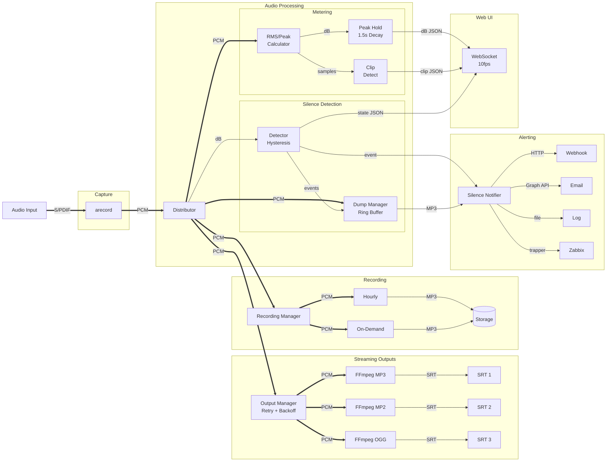

# ZuidWest FM Encoder

Audio streaming software for [ZuidWest FM](https://www.zuidwestfm.nl/) and [Radio Rucphen](https://www.rucphenrtv.nl/). Stream audio from a Raspberry Pi to multiple SRT destinations simultaneously. Built for broadcast environments with real-time monitoring and web-based configuration.


## Features

- **Multi-output streaming** - Send to multiple SRT servers with different codecs simultaneously
- **Real-time VU meters** - Peak hold (1.5 s) with peak/RMS toggle, clip detection, updated via WebSocket
- **Silence detection** - Alerts via webhook, email, file log, or Zabbix when audio drops below threshold
- **Web interface** - Configure outputs, select audio input, monitor levels
- **Auto-recovery** - Automatic reconnection with configurable retry limits per output
- **Multiple codecs** - MP3, MP2, Ogg Vorbis, or uncompressed WAV per output
- **Update notifications** - Alerts when new versions are available
- **Single binary** - Web interface embedded, minimal runtime dependencies

## Platform Support

| Platform | Status | Audio Capture |
|----------|--------|---------------|
| Linux (Raspberry Pi) | **Primary** | arecord (ALSA) |
| macOS | Development only | FFmpeg (AVFoundation) |
| Windows | Experimental | FFmpeg (DirectShow) |

Linux on Raspberry Pi is the primary target. macOS works for development. Windows is experimental.

## Requirements

- Raspberry Pi 4 or 5
- [HiFiBerry Digi+ I/O](https://www.hifiberry.com/shop/boards/hifiberry-digi-io/) or [HiFiBerry DAC+ ADC](https://www.hifiberry.com/shop/boards/dacplus-adc/)
- Raspberry Pi OS Trixie Lite (64-bit)
- `ffmpeg` (for encoding)
- `alsa-utils` (for audio capture via `arecord`)

## Installation

1. Install Raspberry Pi OS Trixie Lite (64-bit)
2. Configure HiFiBerry following the [official guide](https://www.hifiberry.com/docs/software/configuring-linux-3-18-x/)
3. Run the installer as root:

```bash
sudo su
/bin/bash -c "$(curl -fsSL https://raw.githubusercontent.com/oszuidwest/zwfm-encoder/main/deploy/install.sh)"
```

The web interface will be available at `http://<raspberry-pi-ip>:8080`

**Default credentials:** `admin` / `encoder`

## Updating

Run the same installer script to update to the latest version:

```bash
sudo su
/bin/bash -c "$(curl -fsSL https://raw.githubusercontent.com/oszuidwest/zwfm-encoder/main/deploy/install.sh)"
```

The installer detects existing installations and asks whether to:
- **Update only** - Downloads the latest binary while preserving your configuration
- **Fresh install** - Overwrites configuration (existing config is backed up)

The web interface shows a notification when updates are available.

## Audio Input

Connect the digital output of your audio processor to the HiFiBerry input.

**Requirements:**
- 48 kHz sample rate
- 16-bit depth
- Stereo (2 channels)
- S/PDIF format preferred (AES/EBU compatibility not guaranteed)

## Codecs

| Codec | Encoder | Bitrate | Notes |
|-------|---------|---------|-------|
| MP3 | libmp3lame | 320 kbit/s | — |
| MP2 | libtwolame | 384 kbit/s | Uses psymodel 4 |
| Ogg | libvorbis | ~500 kbit/s (Q10) | — |
| WAV | pcm_s16le | Uncompressed | — |

## Silence Detection

Monitors audio levels and sends alerts when silence is detected or recovered. Uses hysteresis to prevent alert flapping:

| Setting | Default | Range | Description |
|---------|---------|-------|-------------|
| Threshold | -40 dB | -60 to 0 | Audio level below which silence is detected |
| Duration | 15 s | 1 to 300 | Seconds of silence before alerting |
| Recovery | 5 s | 1 to 60 | Seconds of audio before recovery |

**Alerting options** (can use multiple simultaneously):
- **Webhook** - POST request to a URL on silence start and recovery
- **Email** - Microsoft Graph API notification to configured recipients on silence start and recovery
- **File Log** - Append JSON Lines to a local file for each silence event
- **Zabbix** - Send trapper items to a Zabbix server on silence start and recovery

Configure via the web interface under Settings → Alerts.

### Microsoft 365 Email Setup

Email notifications use Microsoft Graph API with app-only authentication.

1. [Create an App Registration](https://portal.azure.com/#view/Microsoft_AAD_RegisteredApps/ApplicationsListBlade) → copy **Client ID** and **Tenant ID**
2. Add API permissions: `Mail.Send` (required), `Application.Read.All` (optional, for secret expiry warnings)
3. Grant admin consent
4. Create a client secret → copy the value immediately (won't be shown again)
5. [Create a shared mailbox](https://admin.exchange.microsoft.com/#/sharedmailboxes) as the sender (no license required)

The encoder warns when the secret expires within 30 days.

### Zabbix Setup

1. Import [`zabbix/template.xml`](https://github.com/oszuidwest/zwfm-encoder/blob/main/zabbix/template.xml) in Zabbix (**Data collection** → **Templates** → **Import**)
2. Link the template to your encoder host
3. Configure in the encoder: server, port (default 10051), host name (must match Zabbix exactly), and item key

The template creates triggers for SILENCE (Disaster), RECOVERY (Info), and TEST (Info) events.

## Configuration

Configuration is stored in `/etc/encoder/config.json` on production systems. For development, use the `-config` flag to specify a custom path, or place `config.json` next to the binary.

```json
{
  "system": { "port": 8080, "username": "admin", "password": "encoder" },
  "web": { "station_name": "ZuidWest FM" }
}
```

The installer creates a minimal config file. All other settings are configured through the web interface.

## Event Log

The encoder logs all stream, silence, and recording events to a JSON Lines file for monitoring and debugging. Events are accessible via the web interface and REST API.

See [docs/events.md](docs/events.md) for the complete event reference.

## Health Endpoint

`GET /health` provides a public endpoint for monitoring tools (Kubernetes probes, load balancers, Prometheus, etc.).

| Status | HTTP Code | Condition |
|--------|-----------|-----------|
| `healthy` | 200 OK | Encoder running AND FFmpeg available |
| `unhealthy` | 503 Service Unavailable | Encoder stopped OR FFmpeg missing |

Response example:

```json
{
  "status": "healthy",
  "encoder_state": "running",
  "stream_count": 2,
  "streams_stable": 2,
  "recorder_count": 1,
  "recorders_running": 1,
  "uptime_seconds": 9252,
  "silence_detected": false
}
```

No authentication required.

## Architecture



### Audio Flow

1. **Capture**: `arecord` (Linux) or FFmpeg (macOS/Windows) captures 48kHz 16-bit stereo PCM
2. **Distributor**: Processes PCM in ~100ms chunks, fans out to all consumers
3. **Metering**: Calculates RMS/peak levels in Go (no FFmpeg filters), holds peaks for 1.5s, detects clipping at ±32760
4. **Silence Detection**: Hysteresis-based detection with configurable threshold/duration/recovery. Buffers 15s audio context before/after silence events
5. **Alerting**: Silence triggers webhook, email (MS Graph), log (JSON Lines), and/or Zabbix. Recovery includes MP3 dump attachment
6. **Streaming**: Per-output FFmpeg processes with automatic retry and exponential backoff
7. **Recording**: Hourly rotation or on-demand, with optional S3 upload

## Post-installation

Optional hardening:

```bash
echo "dtoverlay=disable-wifi" >> /boot/firmware/config.txt  # Disable WiFi
apt remove bolt bluez ntfs-3g telnet                        # Remove unused packages
```

## SRT Resources

- [SRT Overview (IETF)](https://datatracker.ietf.org/meeting/107/materials/slides-107-dispatch-srt-overview-01)
- [SRT Deployment Guide](https://www.vmix.com/download/srt_alliance_deployment_guide.pdf)
- [SRT 101 Video](https://www.youtube.com/watch?v=e5YLItNG3lA)

## Related

- [Liquidsoap Server](https://github.com/oszuidwest/liquidsoap-ubuntu) - Companion server software for receiving SRT streams

## License

MIT License - See [LICENSE.md](LICENSE.md)
