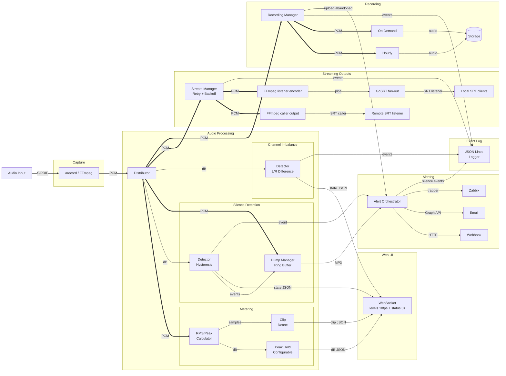

# ZuidWest FM Encoder

Audio streaming software for [ZuidWest FM](https://www.zuidwestfm.nl/) (Linux), [Radio Rucphen](https://www.rucphenrtv.nl/) (Linux) and [BredaNu](https://www.bredanu.nl/) (Windows, also the sole user of the Zabbix integration). Stream audio from a Raspberry Pi to remote SRT destinations, or expose local SRT pull listeners for multiple clients. Built for broadcast environments with real-time monitoring and web-based configuration.


## Features

- **Multi-output streaming** - Push to multiple SRT servers with different codecs simultaneously
- **Multi-client SRT listeners** - Open local pull endpoints so multiple clients can receive the same encoded stream
- **Real-time VU meters** - Configurable peak hold with peak/RMS toggle, clip detection, updated via WebSocket
- **Silence detection** - Alerts via webhook, email, file log, or Zabbix when audio drops below threshold
- **Channel imbalance detection** - Detects dead or mismatched L/R channels with live UI state, event log entries, and readiness status
- **Web interface** - Configure outputs, select audio input, monitor levels
- **Auto-recovery** - Automatic reconnection with configurable retry limits per output
- **Multiple codecs** - MP3, Opus, or uncompressed PCM per output
- **Update notifications** - Alerts when new versions are available
- **Single binary** - Web interface embedded, minimal runtime dependencies

## Platform Support

| Platform | Status | Audio Capture |
|----------|--------|---------------|
| Linux (Raspberry Pi) | **Primary** | arecord (ALSA) |
| macOS | Development only | FFmpeg (AVFoundation) |
| Windows | Experimental | FFmpeg (DirectShow) |

## Deployment Model

This is bare-metal software for a Raspberry Pi with a HiFiBerry sound card - there is no Docker target. Audio capture goes directly through ALSA (`arecord`) on the host, which needs the kernel sound device, the HiFiBerry overlay, and predictable real-time scheduling. Containerizing it would add a layer without solving anything for this hardware path.

Install via the curl script in [Installation](#installation) below. CI publishes the binary as a GitHub release asset; no container image is published.

## Requirements

- Raspberry Pi 4 or 5
- [HiFiBerry Digi+ I/O](https://www.hifiberry.com/shop/boards/hifiberry-digi-io/) or [HiFiBerry DAC+ ADC](https://www.hifiberry.com/shop/boards/dacplus-adc/)
- Raspberry Pi OS Trixie Lite (64-bit)
- `ffmpeg` (for encoding; SRT protocol support is only required for push/caller streams)
- `alsa-utils` (for audio capture via `arecord`)

## Installation

1. Install Raspberry Pi OS Trixie Lite (64-bit)
2. Configure HiFiBerry following the [official guide](https://www.hifiberry.com/docs/software/configuring-linux-3-18-x/)
3. Run the installer as root:

```bash
sudo su
/bin/bash -c "$(curl -fsSL https://raw.githubusercontent.com/oszuidwest/zwfm-encoder/main/deploy/install.sh)"
```

The web interface will be available at `http://<raspberry-pi-ip>:8080`

**Default credentials:** `admin` / `encoder`

## Updating

Run the same installer script to update to the latest version:

```bash
sudo su
/bin/bash -c "$(curl -fsSL https://raw.githubusercontent.com/oszuidwest/zwfm-encoder/main/deploy/install.sh)"
```

The installer detects existing installations and asks whether to:
- **Update only** - Downloads the latest binary while preserving your configuration
- **Fresh install** - Overwrites configuration (existing config is backed up)

The web interface shows a notification when updates are available.

## Audio Input

Connect the digital output of your audio processor to the HiFiBerry input.

**Requirements:**
- 48 kHz sample rate
- 16-bit depth
- Stereo (2 channels)
- S/PDIF format preferred (AES/EBU compatibility not guaranteed)

## Codecs

| Codec | Encoder | Bitrate | Notes |
|-------|---------|---------|-------|
| MP3 | libmp3lame | 320 kbit/s | - |
| Opus | libopus | 128 kbit/s (64-256 configurable) | MPEG-TS container, 10 ms frames |
| PCM | s302m | ~1.92 Mbit/s (16-bit) | MPEG-TS container, SMPTE 302M |

## Silence Detection

Monitors audio levels and sends alerts when silence is detected or recovered. Uses hysteresis to prevent alert flapping:

| Setting | Default | Range | Description |
|---------|---------|-------|-------------|
| Threshold | -40 dB | -60 to -1 | Audio level below which silence is detected |
| Duration | 15 s | 0.5 to 300 | Seconds of silence before alerting |
| Recovery | 5 s | 0.5 to 60 | Seconds of audio before recovery |

## Channel Imbalance Detection

Detects dead or mismatched stereo channels by comparing the left and right RMS levels. Imbalance is only evaluated while at least one channel is above the configured silence threshold, so normal silence is handled by silence detection instead of imbalance detection.

| Setting | Default | Range | Description |
|---------|---------|-------|-------------|
| Threshold | 12 dB | 1 to 59 | L/R level difference above which imbalance is detected |
| Duration | 15 s | 0.5 to 300 | Seconds of imbalance before alerting |
| Recovery | 5 s | 0.5 to 60 | Seconds of balanced audio, or dropped-away audio, before recovery |

Channel imbalance events are written to the event log and exposed in the dashboard, `GET /health`, and `GET /ready`. A confirmed imbalance makes the `channel_imbalance` readiness component fail until the channels recover.

## Alerting

**Silence alerting options** (can use multiple simultaneously, each with per-event control):
- **Webhook** - POST request to a URL; independently enable `silence_start`, `silence_end`, and `audio_dump` (MP3 attachment).
- **Email** - Microsoft Graph API notification; independently enable `silence_start`, `silence_end`, and `audio_dump` (MP3 attachment).
- **File Log** - Appends JSON Lines for every audio event, including silence and channel imbalance events (always records all events, no per-event toggle).
- **Zabbix** - Send trapper items to a Zabbix server; independently enable `silence_start` and `silence_end` (no `audio_dump` - trapper items do not support file attachments).

`silence_end` is sent immediately on recovery; `audio_dump_ready` is dispatched as a separate event once the MP3 encoding completes. Abandoned S3 uploads always alert every configured channel, regardless of per-event toggles.

Configure silence and channel imbalance detection under Settings -> Audio. Configure silence notifications under Settings -> Notifications.

### Microsoft 365 Email Setup

Email notifications use Microsoft Graph API with app-only authentication.

1. [Create an App Registration](https://portal.azure.com/#view/Microsoft_AAD_RegisteredApps/ApplicationsListBlade), then copy the **Client ID** and **Tenant ID**
2. Add API permissions: `Mail.Send` (required), `Application.Read.All` (optional, for secret expiry warnings)
3. Grant admin consent
4. Create a client secret, then copy the value immediately (won't be shown again)
5. [Create a shared mailbox](https://admin.exchange.microsoft.com/#/sharedmailboxes) as the sender (no license required)

The encoder warns when the secret expires within 30 days.

### Zabbix Setup

1. Import [`zabbix/template.xml`](https://github.com/oszuidwest/zwfm-encoder/blob/main/zabbix/template.xml) in Zabbix (**Data collection** -> **Templates** -> **Import**)
2. Link the template to your encoder host
3. Configure in the encoder: server, port (default 10051), host name (must match Zabbix exactly), silence key, and upload key

The template creates triggers for SILENCE (Disaster), RECOVERY (Info), TEST (Info), and UPLOAD_ABANDONED (High) events.

## Recording API

On-demand recordings can be started and stopped via the REST API without going through the web interface. Useful for automation or external systems that need to trigger recordings.

```bash
# Start recording (recorder_id matches the ID in the web interface)
curl -X POST "http://<host>:8080/api/recordings/start?recorder_id=1" \
  -H "X-API-Key: <your-api-key>"

# Stop recording
curl -X POST "http://<host>:8080/api/recordings/stop?recorder_id=1" \
  -H "X-API-Key: <your-api-key>"
```

Configure the API key and maximum recording duration under Settings -> Audio -> Recording API. The `max_duration_minutes` limit automatically stops a recording after the configured time (0 = no limit).

For local recording storage under the packaged systemd service, use `/var/lib/encoder/recordings`. The service owns this state directory even with `ProtectSystem=strict`. Custom archive paths need a systemd override that adds the path to `ReadWritePaths=`.

## Configuration

Configuration is stored in `/etc/encoder/config.json` on production systems. For development, use the `-config` flag to specify a custom path, or place `config.json` next to the binary.

```json
{
  "system": { "port": 8080, "username": "admin", "password": "encoder" },
  "web": { "station_name": "ZuidWest FM" }
}
```

The installer creates a minimal config file. All other settings are configured through the web interface.

## Streaming Modes

Streams can run in two SRT modes:

- **Push to server** (`mode: "caller"`): the encoder connects to a remote SRT listener. `host`, `port`, optional `stream_id`, codec, password, and retry settings behave as before.
- **Local pull listener** (`mode: "listener"`): the encoder opens a local SRT UDP port and multiple clients can connect to the Raspberry Pi at the same time, for example `srt://<encoder-ip>:9000?mode=caller`.

Listener streams bind to `0.0.0.0` when no bind address is entered and do not use `stream_id`; use a separate port for each local listener stream. They use MP3 by default for broad client compatibility; Opus and PCM remain available in MPEG-TS for clients that support them. GoSRT owns the listener socket and fans out one FFmpeg encoder pipe to subscribers, so client disconnects do not restart the encoder. Each listener accepts up to 16 active clients; extra subscribers are rejected until a client disconnects. The stream status shows the listener state, FFmpeg encoder health, and active client count separately.

SRT encryption is optional. Empty passwords allow unencrypted subscribers. Non-empty passwords must be 10-64 characters and use `pbkeylen=16`; password-protected listener streams reject unencrypted subscribers. The configured FFmpeg build must list the exact `srt` protocol in `ffmpeg -hide_banner -protocols` for caller streams; `srtp` alone is not enough. Listener streams do not require FFmpeg SRT support because FFmpeg writes encoded bytes to stdout and GoSRT handles SRT subscribers.

## Event Log

The encoder logs all stream, audio, and recording events to a JSON Lines file for monitoring and debugging. Audio events include silence, audio dump, and channel imbalance events. Events are accessible via the web interface and REST API.
The active log rotates at 50 MiB and keeps one previous file. The web interface and REST API read recent events from both files without loading the full log into memory.

See [docs/events.md](docs/events.md) for the complete event reference.

## Health Endpoint

`GET /health` provides a public endpoint for monitoring tools (Kubernetes probes, load balancers, Prometheus, etc.).

**Healthy (200 OK)** requires both:
- Encoder state is `running` (audio capture active)
- FFmpeg binary is available on the system

**Unhealthy (503 Service Unavailable)** when either:
- Encoder state is `stopped`, `starting`, or `stopping`
- FFmpeg binary is not found

Note: Stream connection failures, silence detection, channel imbalance detection, and recorder errors do **not** affect health status. These are reported in the response body for informational purposes only.

Response example:

```json
{
  "status": "healthy",
  "encoder_state": "running",
  "stream_count": 2,
  "streams_stable": 2,
  "recorder_count": 1,
  "recorders_running": 1,
  "uptime_seconds": 9252,
  "silence_detected": false,
  "channel_imbalance_detected": false
}
```

No authentication required.

## Readiness Endpoint

`GET /ready` is a public production-readiness endpoint. It returns 200 only when the process is usable for broadcast monitoring: FFmpeg is available, the encoder is running, enabled caller streams are stable, no silence alarm is active, no channel imbalance alarm is active, enabled hourly recorders are running, no recorder is in error, and no recording uploads are pending retry. Local pull listener streams are excluded from production-readiness because a running listener means "waiting for clients", not "connected remote output".

The readiness rollup is intentionally strict: one pending recording upload makes the overall endpoint return `503` because the archive path is degraded. A confirmed channel imbalance (for example one dead channel) makes the `channel_imbalance` component not ready, since the broadcast is degraded even though the encoder keeps running. Monitoring that should only page for live broadcast impact should alert on the relevant components in the JSON body, such as `process`, `streams`, `silence`, and `channel_imbalance`, instead of the aggregate `status`. Planned off-air periods or other intentional silence also make the `silence` component not ready while the silence alarm is active.

When any component is not ready, the endpoint returns 503 with component details:

```json
{
  "status": "not_ready",
  "components": {
    "uploads": {
      "ok": false,
      "message": "recording uploads are pending retry",
      "details": { "pending": 1, "max": 0 }
    }
  }
}
```

## Architecture


```mermaid
flowchart LR
    A[Audio Input]

    subgraph Capture["Capture"]
        B[arecord / FFmpeg]
    end

    subgraph Processing["Audio Processing"]
        D[Distributor]

        subgraph Metering["Metering"]
            M[RMS/Peak<br>Calculator]
            PH[Peak Hold<br>Configurable]
            CD[Clip<br>Detect]
        end

        subgraph Silence["Silence Detection"]
            SD[Detector<br>Hysteresis]
            SDM[Dump Manager<br>Ring Buffer]
        end

        subgraph Imbalance["Channel Imbalance"]
            ID[Detector<br>L/R Difference]
        end
    end

    subgraph Outputs["Streaming Outputs"]
        OM[Stream Manager<br>Retry + Backoff]
        F1[FFmpeg caller output]
        F2[FFmpeg listener encoder]
        FO[GoSRT fan-out]
        S1[Remote SRT listener]
        S2[Local SRT clients]
    end

    subgraph Recording["Recording"]
        RM[Recording Manager]
        R1[Hourly]
        R2[On-Demand]
        ST[(Storage)]
    end

    subgraph Alerts["Alerting"]
        SN[Alert Orchestrator]
        N1[Webhook]
        N2[Email]
        N4[Zabbix]
    end

    subgraph UI["Web UI"]
        WS[WebSocket<br>levels 10fps + status 3s]
    end

    subgraph EventLog["Event Log"]
        EL[JSON Lines<br>Logger]
    end

    %% Main audio flow
    A ==>|S/PDIF| B ==>|PCM| D

    %% Metering branch
    D ==>|PCM| M -->|dB| PH
    M -->|samples| CD
    PH -->|dB JSON| WS
    CD -->|clip JSON| WS

    %% Silence detection branch
    D -->|dB| SD
    D ==>|PCM| SDM
    SD -->|events| SDM
    SD -->|state JSON| WS

    %% Channel imbalance branch
    D -->|dB| ID
    ID -->|state JSON| WS

    %% Alerting
    SD -->|event| SN
    SDM -->|MP3| SN
    ID -->|events| EL
    SN -->|HTTP| N1
    SN -->|Graph API| N2
    SN -->|trapper| N4
    SN -->|silence events| EL

    %% Streaming
    D ==>|PCM| OM
    OM ==>|PCM| F1 -->|SRT caller| S1
    OM ==>|PCM| F2 -->|pipe| FO -->|SRT listener| S2
    OM -->|events| EL

    %% Recording
    D ==>|PCM| RM
    RM ==>|PCM| R1 -->|audio| ST
    RM ==>|PCM| R2 -->|audio| ST
    RM -->|events| EL
    RM -->|upload abandoned| SN
```

### Audio Flow

1. **Capture**: `arecord` (Linux) or FFmpeg (macOS/Windows) captures 48kHz 16-bit stereo PCM
2. **Distributor**: Processes PCM in ~100ms chunks, fans out to all consumers
3. **Metering**: Calculates RMS/peak levels in Go (no FFmpeg filters), holds peaks for a configurable duration (default 3000 ms), detects clipping at +/-32760
4. **Silence Detection**: Hysteresis-based detection with configurable threshold/duration/recovery. Buffers 15s audio context before/after silence events
5. **Channel Imbalance Detection**: Hysteresis-based L/R balance detection with configurable threshold/duration/recovery. Reuses the silence threshold as a presence floor and reports live balance/imbalance values.
6. **Alerting**: Silence events trigger webhook, email (MS Graph), log (JSON Lines), and/or Zabbix. Each channel has per-event subscriptions for `silence_start`, `silence_end`, and `audio_dump`. `silence_end` fires immediately on recovery; the `audio_dump_ready` event fires separately once the MP3 is ready. Channel imbalance events are logged and surfaced in health/readiness. Abandoned S3 uploads also trigger notifications.
7. **Streaming**: Per-output FFmpeg encoders; caller streams use FFmpeg SRT with retry/backoff, listener streams use a GoSRT multi-client fan-out around one FFmpeg stdout pipe
8. **Recording**: Hourly rotation or on-demand, with optional S3 upload
9. **Event Log**: All stream, audio, and recording events written to a JSON Lines file; accessible via web UI and REST API with pagination

## Post-installation

Optional hardening:

```bash
echo "dtoverlay=disable-wifi" >> /boot/firmware/config.txt  # Disable WiFi
apt remove bolt bluez ntfs-3g telnet                        # Remove unused packages
```

## SRT Resources

- [SRT Overview (IETF)](https://datatracker.ietf.org/meeting/107/materials/slides-107-dispatch-srt-overview-01)
- [SRT Deployment Guide](https://www.vmix.com/download/srt_alliance_deployment_guide.pdf)
- [SRT 101 Video](https://www.youtube.com/watch?v=e5YLItNG3lA)

## Related

- [Liquidsoap Server](https://github.com/oszuidwest/liquidsoap-ubuntu) - Companion server software for receiving SRT streams

## License

MIT License - See [LICENSE.md](LICENSE.md)
