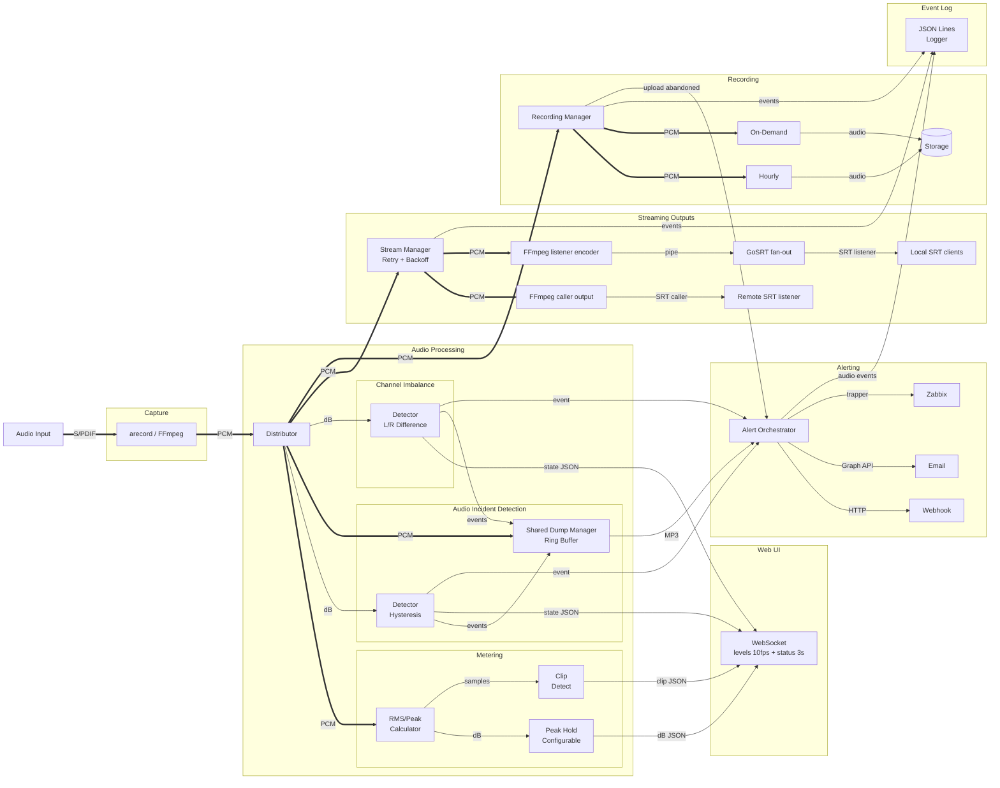

# ZuidWest FM Encoder

Audio streaming software for [ZuidWest FM](https://www.zuidwestfm.nl/) (Linux), [Radio Rucphen](https://www.rucphenrtv.nl/) (Linux) and [BredaNu](https://www.bredanu.nl/) (Windows, also the sole user of the Zabbix integration). Stream audio from a Raspberry Pi to remote SRT destinations, or expose local SRT pull listeners for multiple clients. Built for broadcast environments with real-time monitoring and web-based configuration.


## Key features

- **Multi-output streaming** - Push to SRT servers or expose local endpoints for monitoring
- **Multi-recorder support** - Run multiple recording jobs with local and/or S3 storage, hourly rotation, retention cleanup and on-demand control
- **Configurable VU meters** - Peak/RMS metering with configurable peak hold and clip detection
- **Silence detection** - Alerts via webhook, email, file log, or Zabbix when audio drops below threshold
- **Audio incident dumps** - Capture audio around silence and channel imbalance events for troubleshooting
- **Channel imbalance detection** - Detects dead or mismatched L/R channels with webhook, email, file log, Zabbix, live UI, and readiness status
- **Multiple codecs** - MP3, Opus, or uncompressed PCM per output
- **Single binary** - Web interface embedded, minimal runtime dependencies

## Platform Support

| Platform | Status | Audio Capture |
|----------|--------|---------------|
| Linux (Raspberry Pi) | **Primary** | arecord (ALSA) |
| macOS | Development only | FFmpeg (AVFoundation) |
| Windows | Experimental | FFmpeg (DirectShow) |

The Windows build launches as a systray application without a console window: right-click the tray icon for Open UI / Start / Stop / Show Logs / Quit. slog output is redirected to `%PROGRAMDATA%\encoder\encoder.log` when no console is attached, falling back to `%LOCALAPPDATA%\encoder\encoder.log` and then the system temp directory if that path is not writable; the operational event log stays at `%PROGRAMDATA%\encoder\logs\<port>\encoder.jsonl`.

## Deployment

This is bare-metal software for a Raspberry Pi with a HiFiBerry sound card. Audio capture goes directly through ALSA (`arecord`). Install via the curl script in [Installation](#installation) below. CI publishes the binary as a GitHub release asset; no container image is published.

## Requirements

- Raspberry Pi 4 or 5
- [HiFiBerry Digi+ I/O](https://www.hifiberry.com/shop/boards/hifiberry-digi-io/) or [HiFiBerry DAC+ ADC](https://www.hifiberry.com/shop/boards/dacplus-adc/)
- Raspberry Pi OS Trixie Lite (64-bit)
- `ffmpeg` (for encoding; SRT protocol support is only required for push/caller streams)
- `alsa-utils` (for audio capture via `arecord`)

## Installation

1. Install Raspberry Pi OS Trixie Lite (64-bit)
2. Configure HiFiBerry following the [official guide](https://www.hifiberry.com/docs/software/configuring-linux-3-18-x/)
3. Run the installer as root:

```bash
sudo su
/bin/bash -c "$(curl -fsSL https://raw.githubusercontent.com/oszuidwest/zwfm-encoder/main/deploy/install.sh)"
```

The web interface will be available at `http://<raspberry-pi-ip>:8080`

**Default credentials:** `admin` / `encoder`

## Updating

Run the same installer script to update to the latest version:

```bash
sudo su
/bin/bash -c "$(curl -fsSL https://raw.githubusercontent.com/oszuidwest/zwfm-encoder/main/deploy/install.sh)"
```

The installer detects existing installations and asks whether to:
- **Update only** - Downloads the latest binary while preserving your configuration
- **Fresh install** - Overwrites configuration (existing config is backed up)

The web interface shows a notification when updates are available.

## Audio Input

Connect the audio output of your audio processor to the HiFiBerry input.

**Requirements:**
- 48 kHz sample rate
- 16-bit depth
- Stereo (2 channels)

### Dante-compatible input

The encoder can receive two Dante-compatible transmitter channels directly in the Go process. It discovers the named channels over mDNS, requests a unicast flow from the transmitter, reorders media packets, fills missing packets with silence, and converts 16/24/32-bit network PCM to the encoder's 48 kHz stereo S16LE format. No Dante Virtual Soundcard or other external software is needed.

Set `audio.input` in `config.json` to a Dante-compatible input URI:

```json
{
  "audio": {
    "input": "dante://studio-tx/Program%20L/Program%20R?interface=eth0"
  }
}
```

The URI format is `dante://TRANSMITTER/LEFT_CHANNEL/RIGHT_CHANNEL?interface=INTERFACE`. Percent-encode spaces and other reserved characters in channel names.

Device and channel names are limited to 31 ASCII characters. Device names contain only letters, digits and hyphens, and cannot start or end with a hyphen; do not include a port or `.local` suffix. Channel names use printable ASCII except `=`, `.` and `@`. Spaces and percent-encoded `/`, `?` and `#` remain supported. Invalid names are rejected before discovery starts.

The web interface shows a configured Dante-compatible input in the Input Device selector; choosing another device there replaces it. Dante-compatible inputs are set in `config.json` only.

The interface is optional; when omitted, mDNS runs on all interfaces and the source address the OS routes toward the transmitter is used. The transmitter must run at 48 kHz and advertise 16-, 24-, or 32-bit PCM. The encoder and transmitter must be on a network where mDNS multicast and the Dante-compatible UDP traffic are permitted.

This receive-only Dante-compatible implementation is experimental and unofficial. It is not Dante-certified. It selects channels by name in the encoder configuration and does not advertise the encoder as a routable receiver in Dante Controller.

The compatible protocol behavior is described in [`docs/dante-protocol.md`](docs/dante-protocol.md).

The receiver was reimplemented using a two-team clean-room process: Claude produced the functional specification, and Codex implemented it in an isolated environment without network access or access to prior implementations.

`Dante` is a trademark of Audinate Pty Ltd. This unofficial project is not affiliated with, authorized, sponsored, certified, approved, or endorsed by Audinate.

## Codecs

| Codec | Encoder | Bitrate | Notes |
|-------|---------|---------|-------|
| MP3 | libmp3lame | 320 kbit/s | - |
| Opus | libopus | 128 kbit/s (64-256 configurable) | MPEG-TS container, 10 ms frames |
| PCM | s302m | ~1.92 Mbit/s (16-bit) | MPEG-TS container, SMPTE 302M |

## Silence Detection

Monitors audio levels and sends alerts when silence is detected or recovered. Uses hysteresis to prevent alert flapping:

| Setting | Default | Range | Description |
|---------|---------|-------|-------------|
| Threshold | -40 dB | -60 to -1 | Audio level below which silence is detected |
| Duration | 15 s | 0.5 to 300 | Seconds of silence before alerting |
| Recovery | 5 s | 0.5 to 60 | Seconds of audio before recovery |

## Audio Input Recovery

If stopping an input exceeds the shutdown timeout, the encoder remains `stopping` and rejects a new start until the old source and its audio reader have exited. Once shutdown completes it becomes `stopped` and can be started again.

If the audio input disappears (a capture error, an unplugged USB interface, a Dante transmitter that stops sending), the encoder keeps reopening it. After a failed attempt it waits 3 seconds, doubling up to 10 seconds, plus up to 50% random jitter, so never more than 15 seconds. It never gives up, so audio resumes on its own when the input returns. A capture that keeps running but delivers no audio is treated as failed and reopened too: when no audio arrives within 30 seconds of opening the input, or audio stops for 10 seconds. Streams and recorders keep running in the meantime. The dashboard shows the reconnect attempts and the error of the last failed attempt.

The first failure of an outage writes an `input_lost` event and alerts every configured audio channel (webhook, email, Zabbix). Once the input has delivered steady audio (no pause over 2 seconds) for 10 seconds again, an `input_restored` event with the outage duration follows. Like abandoned uploads, these alerts go to every channel configured at that moment, regardless of per-event toggles. An open outage survives stopping and starting the encoder: it raises no second `input_lost`, and the next confirmed input, also from a newly selected device, closes it with a duration that includes the stopped time. After a process restart, the encoder restores an open outage from the latest input event in the retained event logs (including the rotated log). The next confirmed input then closes the incident and Zabbix problem as usual; an already-restored input does not produce another recovery. `GET /health` reports `503` between reopen attempts; while a reopened capture runs it reports `200`, even before that capture delivers audio.

## Channel Imbalance Detection

Detects dead or mismatched stereo channels by comparing the left and right RMS levels. Imbalance is only evaluated while at least one channel is above the configured silence threshold, so normal silence is handled by silence detection instead of imbalance detection.

| Setting | Default | Range | Description |
|---------|---------|-------|-------------|
| Threshold | 12 dB | 1 to 59 | L/R level difference above which imbalance is detected |
| Duration | 15 s | 0.5 to 300 | Seconds of imbalance before alerting |
| Recovery | 5 s | 0.5 to 60 | Seconds of balanced audio, or dropped-away audio, before recovery |

Channel imbalance events can trigger webhook, email, and Zabbix notifications, are written to the event log, and are exposed in the dashboard, `GET /health`, and `GET /ready`. A confirmed imbalance makes the `channel_imbalance` readiness component fail until the channels are balanced again or audio drops away. When audio incident dumps are enabled, recovery also produces an MP3 with 15 seconds of context before and after the imbalance; the existing `audio_dump` webhook/email subscription controls its delivery.

## Alerting

**Audio alerting options** (can use multiple simultaneously, each with per-event control):
- **Webhook** - POST request to a URL (redirects are rejected, so configure the final URL); independently enable `silence_start`, `silence_end`, `audio_dump`, `channel_imbalance_start`, and `channel_imbalance_end`.
- **Email** - Microsoft Graph API notification; independently enable `silence_start`, `silence_end`, `audio_dump`, `channel_imbalance_start`, and `channel_imbalance_end`.
- **File Log** - Appends JSON Lines for every audio event, including silence and channel imbalance events (always records all events, no per-event toggle).
- **Zabbix** - Send trapper items to a Zabbix server; independently enable `silence_start`, `silence_end`, `channel_imbalance_start`, and `channel_imbalance_end` (no `audio_dump` - trapper items do not support file attachments).

`silence_end` and `channel_imbalance_end` are sent immediately when recovery is confirmed; `audio_dump_ready` is dispatched as a separate event once the MP3 context for either incident type finishes encoding. Its `trigger` field is `silence` or `channel_imbalance`. Lost and restored audio inputs and abandoned S3 uploads always alert every configured channel, regardless of per-event toggles.

Configure silence and channel imbalance detection under Settings -> Audio. Configure audio notifications under Settings -> Notifications.

### Microsoft 365 Email Setup

Email notifications use Microsoft Graph API with app-only authentication.

1. [Create an App Registration](https://portal.azure.com/#view/Microsoft_AAD_RegisteredApps/ApplicationsListBlade), then copy the **Client ID** and **Tenant ID**
2. Add API permissions: `Mail.Send` (required), `Application.Read.All` (optional, for secret expiry warnings)
3. Grant admin consent
4. Create a client secret, then copy the value immediately (won't be shown again)
5. [Create a shared mailbox](https://admin.exchange.microsoft.com/#/sharedmailboxes) as the sender (no license required)

The encoder warns when the secret expires within 30 days.

### Zabbix Setup

1. Import [`zabbix/template.xml`](https://github.com/oszuidwest/zwfm-encoder/blob/main/zabbix/template.xml) in Zabbix (**Data collection** -> **Templates** -> **Import**)
2. Link the template to your encoder host
3. Configure in the encoder: server, port (default 10051), host name (must match Zabbix exactly), silence key, imbalance key, and upload key

The template creates triggers for SILENCE (Disaster), RECOVERY (Info), INPUT_LOST (Disaster, recovers on INPUT_RESTORED), CHANNEL_IMBALANCE (High), CHANNEL_BALANCED (Info), TEST (Info), and UPLOAD_ABANDONED (High) events. Input events use the silence key; re-import the template to add the INPUT_LOST trigger. Channel imbalance uses a separate `imbalance.alert` item; Zabbix imbalance notifications only work when `imbalance_key` is configured and the matching trapper item exists.

## Hourly Recording

New recording filenames and S3 namespaces are tied to the recorder ID, not its display name: the prefix is `@` followed by the lowercase hexadecimal encoding of the ID bytes (for example, ID `r1` becomes `@7231`). IDs over 80 bytes use `@h` followed by their SHA-256 digest so filenames and quarantine sidecars fit filesystem component limits. Local files stay in the configured directory; new S3 objects use `recordings/<id-prefix>/<filename>`. Case-different IDs stay distinct; neither namespace can overlap an old sanitized display name. Existing display-name collision validation is retained for compatibility.

New recorder IDs use 128 random bits because file ownership outlives deleting a recorder. Existing IDs are preserved.

Hourly recorders start a new file on every whole hour (whole UTC hours, which are the local hours in time zones with a whole-hour offset), named after the local time of the hand-over rounded to the minute, such as `<id-prefix>-YYYY-MM-DD-HH-00.<ext>`; the first file after a start is named after its start minute. At the boundary the next file is started before the current one is finalized, so the hand-over itself drops no audio; the previous file is then closed and queued for upload when S3 is configured. When the local clock repeats an hour, as at the end of daylight saving time, the second file of that hour gets a `-2` suffix instead of overwriting the first.

On loading an older config, the current sanitized name is captured once in internal `legacy_file_prefix` metadata, with `id_based_files` marking that initialization is complete. API replacements preserve this metadata through subsequent renames and saves. Retention checks both that original prefix and the stable ID namespace; old local files and S3 objects are not moved or copied. Existing pending uploads retain their exact local path, original object key and upload identity. A new recorder has no legacy claim, so reusing a deleted recorder's display name does not adopt its leftover files. Preserve these internal fields when editing config manually. Files already stranded under untracked names before the upgrade cannot be assigned safely from their names alone; verify their ownership manually instead of guessing.

Output names are reserved with an exclusive create before FFmpeg starts. Existing files (including symlinks) cause a numeric suffix retry; they are never adopted as the new recording. File permissions still follow the process umask and directory ACLs. Use recording directories writable only by trusted operators: FFmpeg reopens its reserved output path. If that path is replaced before finalization, the recorder reports an ownership error and neither uploads nor removes the replacement; its `.unfinalized` marker keeps it out of uploads, also after a restart.

A successfully finalized run that received no PCM (for example during an input outage) is removed without uploading. Partial hours and digital silence are kept. Before FFmpeg starts, each output gets a `<filename>.unfinalized` marker. Failed writes, finalizations, writer-drain timeouts or empty-file removals retain that marker and any file FFmpeg wrote to for inspection (an untouched empty placeholder is removed with its marker); marked files are not uploaded, including after a process restart. A recording cannot start if its marker cannot be persisted. Successful finalization clears the marker before upload; a failed marker removal also prevents upload. A crash or power loss while a file is open also leaves it marked, so that partial hour is kept for inspection instead of being uploaded at the next start; every recorder start logs a warning per marked file. Local retention (local and both storage modes) still applies and removes the marker only after deleting its expired recording; marked files in the S3-only spool are kept until removed by hand.

Do not remove an `.unfinalized` marker just to retry an upload: first stop the recorder, inspect the retained file and recover usable audio manually. Zero-byte legacy spool files are also retained without upload. Nonempty orphan files created by older versions have no reliable finalization history and keep the existing recovery behavior; inspect or move any suspect legacy files out of the spool before upgrading. Markers protect process-restart recovery; power-loss durability of the recording filesystem is not guaranteed.

A failed hourly finalization reports exactly one `recorder_error` while the next file can remain `running`. In that case `status.error` is the last recording warning, not a statement that the current file has stopped; it clears at the next successful rotation, Stop, or a new successful start. The UI state indicator and `/ready` recorder check follow the process state, so monitor `recorder_error` events and `status.error` as well. A writer-drain timeout is always reported, even when FFmpeg was deliberately killed to unblock it.

On Linux, a recorder starts its first file only once the kernel reports the system clock as NTP-synchronized, because file names and retention cleanup come from the clock and a Raspberry Pi has no real-time clock. Until then it stays `starting` with the error `waiting for system clock synchronization`; a waiting hourly recorder makes `GET /ready` not ready, an on-demand recording can still be stopped, and streaming is not affected. The installer enables NTP. systemd-timesyncd and chrony (Debian's default `rtcsync`) mark the clock synchronized; a system that keeps time without such a client never starts recording, and ntpsec before Debian trixie marks the clock synchronized at startup, so it gives no protection. If the synchronization state cannot be read, recording starts with a warning.

## Recording API

Recorder startup, hourly file preparation and concurrent configuration changes do not hold up audio capture for streams or other recorders. During hourly preparation the current file keeps receiving audio until the replacement is ready. If an individual recorder's writer stops consuming audio, its bounded buffer drops new chunks and reports `audio_drops`; recording control operations may still wait for that recorder's filesystem.

S3 upload retries pause after 24 hours and raise an `upload_abandoned` alert. The recording and its upload metadata are retained, including in S3-only mode (in local+S3 mode, local retention still applies to the local copy). Fix S3 configuration/connectivity and restart the encoder process (not just the audio input) to re-queue abandoned uploads with their original object keys and a fresh retry window. There is no automatic disk-space eviction of unuploaded spool recordings: monitor free space and respond to upload alerts. On Linux the default spool is `/var/lib/encoder/recordings`, with recordings under `recorders/<id>/` and metadata under `uploads/<id>/`.

S3 storage must support `If-None-Match: *`, preserve user metadata, and allow reading object metadata via `HeadObject` (AWS requires `s3:GetObject`; see [HeadObject permissions](https://docs.aws.amazon.com/AmazonS3/latest/API/API_HeadObject.html)). The S3 connection test checks metadata round-tripping. An upload identity and its original object key are saved before any upload; retries, multipart completion failures and process restarts reuse that identity. A matching committed object counts as success, while a different recording gets a numeric suffix based on the original key. If an existing object cannot be verified, the local recording stays queued instead of being duplicated or discarded. Legacy objects without upload identities are treated as foreign, never overwritten; commits made by older versions cannot be retroactively identified.

On-demand recordings can be started and stopped via the REST API without going through the web interface. Useful for automation or external systems that need to trigger recordings.

```bash
# Start recording (recorder_id matches the ID in the web interface)
curl -X POST "http://<host>:8080/api/recordings/start?recorder_id=1" \
  -H "X-API-Key: <your-api-key>"

# Stop recording
curl -X POST "http://<host>:8080/api/recordings/stop?recorder_id=1" \
  -H "X-API-Key: <your-api-key>"
```

Configure the API key and maximum recording duration under Settings -> Audio -> Recording API. The `max_duration_minutes` limit automatically stops a recording after the configured time (0 = no limit).

For local recording storage under the packaged systemd service, use `/var/lib/encoder/recordings`. The service owns this state directory even with `ProtectSystem=strict`. Custom archive paths need a systemd override that adds the path to `ReadWritePaths=`.

## Configuration

Configuration is stored in `/etc/encoder/config.json` on production systems. For development, use the `-config` flag to specify a custom path, or place `config.json` next to the binary.

```json
{
  "system": { "port": 8080, "username": "admin", "password": "encoder" },
  "web": { "station_name": "ZuidWest FM" }
}
```

The installer creates a minimal config file. All other settings are configured through the web interface.

## Streaming Modes

Streams support two SRT modes:

- **Push to server** (`mode: "caller"`): the encoder connects to a remote SRT listener using the configured host, port, codec, password, stream ID, and retry settings.
- **Local pull listener** (`mode: "listener"`): the encoder opens a local SRT port so clients can pull the stream, for example `srt://<encoder-ip>:9000?mode=caller`.

Listener streams bind to `0.0.0.0` by default, use a separate port per stream, and accept up to 16 clients. They do not use `stream_id`. Client disconnects do not restart the encoder. SRT encryption is optional. Empty passwords allow unencrypted connections; non-empty passwords must be 10-64 characters. Caller mode requires FFmpeg with `srt` protocol support, while listener mode uses GoSRT and does not.

## Event Log

The encoder logs all stream, audio, and recording events to a JSON Lines file for monitoring and debugging. Audio events include silence, audio dump, and channel imbalance events. Events are accessible via the web interface and REST API.

The active log rotates at 50 MiB and keeps one previous file. The web interface and REST API read recent events from both files without loading the full log into memory.

See [docs/events.md](docs/events.md) for the complete event reference.

## Health Endpoint

`GET /health` provides a public endpoint for monitoring tools (Kubernetes probes, load balancers, Prometheus, etc.).

**Healthy (200 OK)** requires both:
- Encoder state is `running` (audio capture active)
- FFmpeg binary is available on the system

**Unhealthy (503 Service Unavailable)** when either:
- Encoder state is `stopped`, `starting`, or `stopping`
- FFmpeg binary is not found

Note: Stream connection failures, silence detection, channel imbalance detection, and recorder errors do **not** affect health status. These are reported in the response body for informational purposes only.

Response example:

```json
{
  "status": "healthy",
  "encoder_state": "running",
  "stream_count": 2,
  "streams_stable": 2,
  "recorder_count": 1,
  "recorders_running": 1,
  "uptime_seconds": 9252,
  "silence_detected": false,
  "channel_imbalance_detected": false
}
```

No authentication required.

## Readiness Endpoint

`GET /ready` is a public production-readiness endpoint. It returns 200 only when the process is usable for broadcast monitoring: FFmpeg is available, the encoder is running, the current input has delivered PCM within the last 2 seconds with no open input outage, enabled caller streams are stable, no silence alarm is active, no channel imbalance alarm is active, enabled hourly recorders are running, no recorder is in error, and no recording uploads are pending retry. Local pull listener streams are excluded from production-readiness because a running listener means "waiting for clients", not "connected remote output".

The `input` component fails before the first PCM arrives, when audio stops arriving for over 2 seconds, and while an input outage awaits confirmation of stable audio after recovery. Opening the device again alone does not clear an outage. The encoder status exposes the same condition as `input_ready`. `/health` retains its process-health meaning and can still return 200 for an open device that is not delivering audio.

The readiness rollup is intentionally strict: one pending recording upload makes the overall endpoint return `503` because the archive path is degraded. A confirmed channel imbalance (for example one dead channel) makes the `channel_imbalance` component not ready, since the broadcast is degraded even though the encoder keeps running. Monitoring that should only page for live broadcast impact should alert on the relevant components in the JSON body, such as `process`, `input`, `streams`, `silence`, and `channel_imbalance`, instead of the aggregate `status`. Planned off-air periods or other intentional silence also make the `silence` component not ready while the silence alarm is active.

When any component is not ready, the endpoint returns 503 with component details:

```json
{
  "status": "not_ready",
  "components": {
    "uploads": {
      "ok": false,
      "message": "recording uploads are pending retry",
      "details": { "pending": 1, "max": 0 }
    }
  }
}
```

## Architecture


```mermaid
flowchart LR
    A[Audio Input]

    subgraph Capture["Capture"]
        B[arecord / FFmpeg]
    end

    subgraph Processing["Audio Processing"]
        D[Distributor]

        subgraph Metering["Metering"]
            M[RMS/Peak<br>Calculator]
            PH[Peak Hold<br>Configurable]
            CD[Clip<br>Detect]
        end

        subgraph Silence["Audio Incident Detection"]
            SD[Detector<br>Hysteresis]
            SDM[Shared Dump Manager<br>Ring Buffer]
        end

        subgraph Imbalance["Channel Imbalance"]
            ID[Detector<br>L/R Difference]
        end
    end

    subgraph Outputs["Streaming Outputs"]
        OM[Stream Manager<br>Retry + Backoff]
        F1[FFmpeg caller output]
        F2[FFmpeg listener encoder]
        FO[GoSRT fan-out]
        S1[Remote SRT listener]
        S2[Local SRT clients]
    end

    subgraph Recording["Recording"]
        RM[Recording Manager]
        R1[Hourly]
        R2[On-Demand]
        ST[(Storage)]
    end

    subgraph Alerts["Alerting"]
        SN[Alert Orchestrator]
        N1[Webhook]
        N2[Email]
        N4[Zabbix]
    end

    subgraph UI["Web UI"]
        WS[WebSocket<br>levels 10fps + status 3s]
    end

    subgraph EventLog["Event Log"]
        EL[JSON Lines<br>Logger]
    end

    %% Main audio flow
    A ==>|S/PDIF| B ==>|PCM| D

    %% Metering branch
    D ==>|PCM| M -->|dB| PH
    M -->|samples| CD
    PH -->|dB JSON| WS
    CD -->|clip JSON| WS

    %% Silence detection branch
    D -->|dB| SD
    D ==>|PCM| SDM
    SD -->|events| SDM
    SD -->|state JSON| WS

    %% Channel imbalance branch
    D -->|dB| ID
    ID -->|state JSON| WS
    ID -->|events| SDM

    %% Alerting
    SD -->|event| SN
    SDM -->|MP3| SN
    ID -->|event| SN
    SN -->|HTTP| N1
    SN -->|Graph API| N2
    SN -->|trapper| N4
    SN -->|audio events| EL

    %% Streaming
    D ==>|PCM| OM
    OM ==>|PCM| F1 -->|SRT caller| S1
    OM ==>|PCM| F2 -->|pipe| FO -->|SRT listener| S2
    OM -->|events| EL

    %% Recording
    D ==>|PCM| RM
    RM ==>|PCM| R1 -->|audio| ST
    RM ==>|PCM| R2 -->|audio| ST
    RM -->|events| EL
    RM -->|upload abandoned| SN
```

### Audio Flow

1. **Capture**: `arecord` (Linux) or FFmpeg (macOS/Windows) captures 48kHz 16-bit stereo PCM
2. **Distributor**: Processes PCM in ~100ms chunks, fans out to all consumers
3. **Metering**: Calculates RMS/peak levels in Go (no FFmpeg filters), holds peaks for a configurable duration (default 3000 ms), detects clipping at +/-32760
4. **Silence Detection**: Hysteresis-based detection with configurable threshold/duration/recovery. The shared dump manager buffers 15s audio context before/after silence events.
5. **Channel Imbalance Detection**: Hysteresis-based L/R balance detection with configurable threshold/duration/recovery. Reuses the silence threshold as a presence floor, reports live balance/imbalance values, and uses the shared dump manager for recovery context.
6. **Alerting**: Silence and channel imbalance events trigger webhook, email (MS Graph), log (JSON Lines), and/or Zabbix. Webhook and email support per-event subscriptions for `silence_start`, `silence_end`, `audio_dump`, `channel_imbalance_start`, and `channel_imbalance_end`; Zabbix supports the same set except `audio_dump`. `silence_end` and `channel_imbalance_end` fire immediately when recovery is confirmed; `audio_dump_ready` fires separately once the MP3 is ready. Abandoned S3 uploads also trigger notifications.
7. **Streaming**: Per-output FFmpeg encoders; caller streams use FFmpeg SRT with retry/backoff, listener streams use a GoSRT multi-client fan-out around one FFmpeg stdout pipe
8. **Recording**: Hourly rotation or on-demand, with optional S3 upload
9. **Event Log**: All stream, audio, and recording events written to a JSON Lines file; accessible via web UI and REST API with pagination

## Post-installation

Optional hardening:

```bash
echo "dtoverlay=disable-wifi" >> /boot/firmware/config.txt  # Disable WiFi
apt remove bolt bluez ntfs-3g telnet                        # Remove unused packages
```

## SRT Resources

- [SRT Overview (IETF)](https://datatracker.ietf.org/meeting/107/materials/slides-107-dispatch-srt-overview-01)
- [SRT Deployment Guide](https://www.vmix.com/download/srt_alliance_deployment_guide.pdf)
- [SRT 101 Video](https://www.youtube.com/watch?v=e5YLItNG3lA)

## Related

- [Liquidsoap Server](https://github.com/oszuidwest/liquidsoap-ubuntu) - Companion server software for receiving SRT streams

## License

MIT License - See [LICENSE.md](LICENSE.md)
